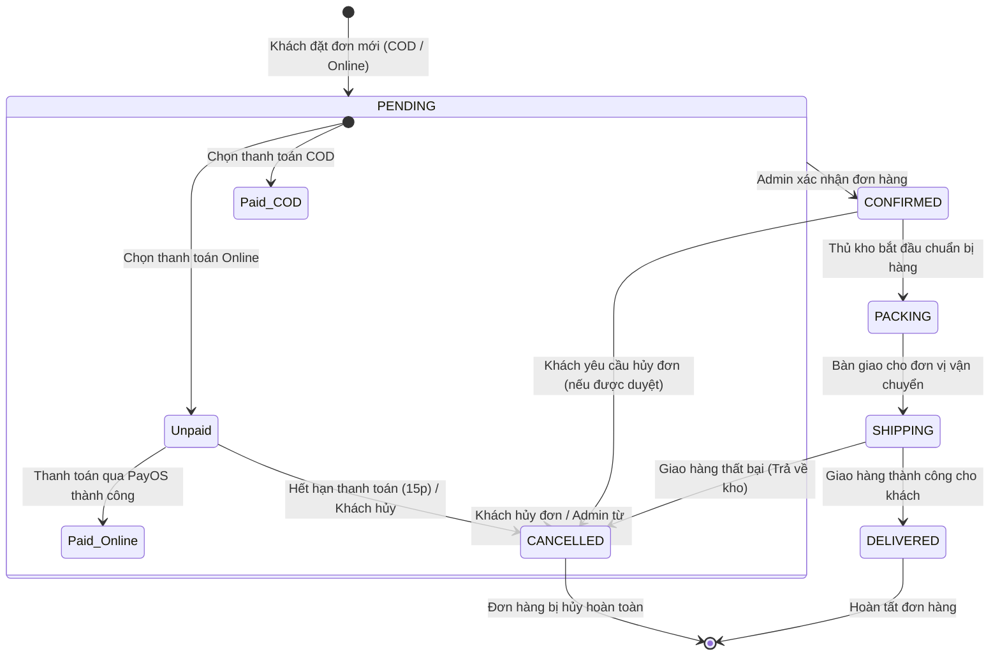
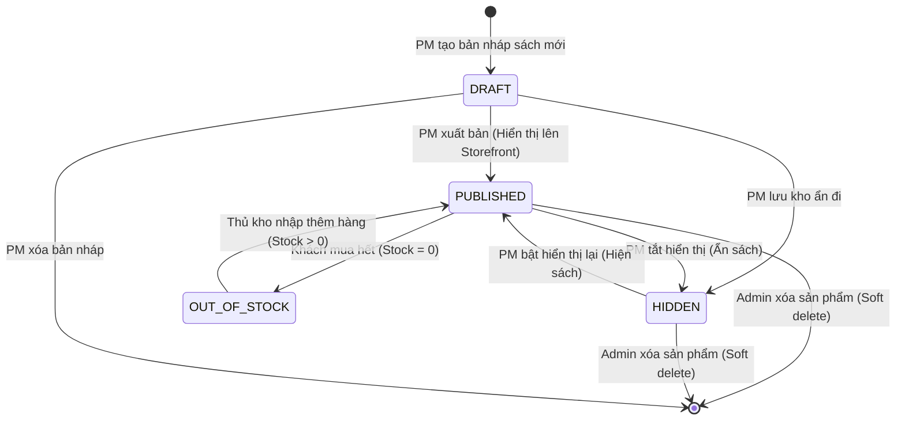
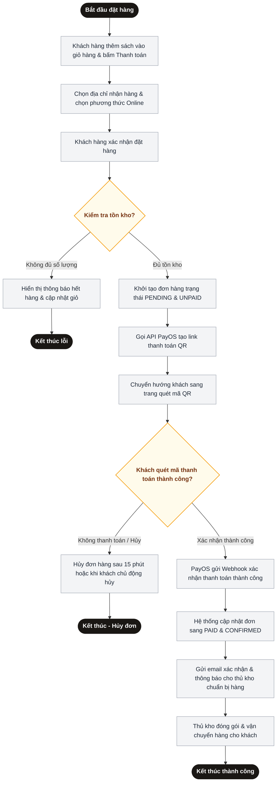

# Biểu đồ UML - Báo cáo nộp cuối Tuần 5

Tài liệu này chứa các biểu đồ UML được yêu cầu cho sản phẩm nộp cuối Tuần 5 của dự án **Hiệu Sách Chin**:
1. **Biểu đồ Trạng thái (State Diagram)** cho 2 đối tượng chính: **Đơn hàng (Order)** và **Sản phẩm (Book/Product)**.
2. **Biểu đồ Hoạt động (Activity Diagram)** cho quy trình nghiệp vụ: **Quy trình Đặt hàng & Thanh toán trực tuyến**.

---

## 1. Biểu đồ Trạng thái (State Diagram) - Đơn hàng (Order)

Biểu đồ này mô tả vòng đời của một đơn hàng từ lúc được khách hàng khởi tạo, xác nhận, đóng gói, vận chuyển cho đến khi kết thúc (hoàn thành hoặc bị hủy).

---

## 2. Biểu đồ Trạng thái (State Diagram) - Sách / Sản phẩm (Product)

Biểu đồ này mô tả các trạng thái của một cuốn sách trong hệ thống quản lý của cửa hàng từ khi tạo bản nháp, xuất bản công khai, hết hàng, ẩn sản phẩm cho đến khi bị xóa khỏi hệ thống.

---

## 3. Biểu đồ Hoạt động (Activity Diagram) - Quy trình Đặt hàng & Thanh toán Online

Biểu đồ mô tả quy trình nghiệp vụ mua hàng và thanh toán trực tuyến qua cổng PayOS/VietQR của khách hàng trên hệ thống.

