# Use-Case Diagram: Admin Role (Quản trị viên)

Tài liệu này mô tả chi tiết sơ đồ Usecase và các chức năng của vai trò **Quản trị viên (Admin)** - người có toàn quyền quản trị cao nhất trên hệ thống **Hiệu Sách Chin**.

---

## 1. Sơ đồ Use-Case (Mermaid)

Sơ đồ dưới đây tổng hợp các phân hệ chức năng mà Admin có quyền quản trị và thực hiện.

```mermaid
graph TB
    %% Định nghĩa phong cách màu sắc (Styling Classes)
    classDef actorStyle fill:#1a1714,stroke:#1a1714,stroke-width:2px,color:#faf8f5,font-weight:bold;
    classDef authStyle fill:#fee2e2,stroke:#f87171,stroke-width:1.5px,color:#991b1b;
    classDef dashStyle fill:#e0f2fe,stroke:#38bdf8,stroke-width:1.5px,color:#0369a1;
    classDef orderStyle fill:#faf5ff,stroke:#c084fc,stroke-width:1.5px,color:#6b21a8;
    classDef staffStyle fill:#e6fffa,stroke:#4fd1c5,stroke-width:1.5px,color:#234e52;
    classDef crmStyle fill:#dcfce7,stroke:#4ade80,stroke-width:1.5px,color:#166534;
    classDef settingsStyle fill:#fef3c7,stroke:#fbbf24,stroke-width:1.5px,color:#92400e;
    classDef contentStyle fill:#fff1f2,stroke:#fda4af,stroke-width:1.5px,color:#9f1239;

    %% Tác nhân (Actor)
    Admin["👤 Quản trị viên<br>(Admin)"]:::actorStyle

    %% Phân hệ 1: Xác thực
    subgraph Sub_Auth ["🔒 Xác thực & Bảo mật"]
        UC_Login("(Đăng nhập Portal Admin)"):::authStyle
        UC_Logout("(Đăng xuất)"):::authStyle
    end

    %% Phân hệ 2: Báo cáo & Thống kê
    subgraph Sub_Dash ["📊 Báo cáo & Phân tích"]
        UC_ViewAnalytics("(Xem biểu đồ doanh thu & chỉ số)"):::dashStyle
        UC_ExportCSV("(Xuất báo cáo doanh thu ra CSV)"):::dashStyle
    end

    %% Phân hệ 3: Quản lý nhân viên
    subgraph Sub_Staff ["👥 Quản trị Nhân viên nội bộ"]
        UC_ManageStaff("(CRUD tài khoản PM / Thủ kho)"):::staffStyle
        UC_LockStaff("(Khóa/Mở khóa tài khoản nhân viên)"):::staffStyle
    end

    %% Phân hệ 4: Quản lý khách hàng
    subgraph Sub_CRM ["👤 Quản lý Khách hàng (CRM)"]
        UC_ViewUsers("(Xem danh sách & Hồ sơ mua hàng)"):::crmStyle
        UC_LockUser("(Khóa/Mở khóa tài khoản khách hàng)"):::crmStyle
    end

    %% Phân hệ 5: Xử lý Đơn hàng
    subgraph Sub_Order ["🚚 Quản lý Đơn hàng toàn cục"]
        UC_ViewAllOrders("(Xem & Lọc tất cả đơn hàng)"):::orderStyle
        UC_UpdateOrderStatus("(Duyệt đơn & Cập nhật trạng thái)"):::orderStyle
        UC_CancelOrder("(Hủy đơn hàng của khách)"):::orderStyle
        UC_BulkAction("(Thao tác hàng loạt trên đơn hàng)"):::orderStyle
    end

    %% Phân hệ 6: Quản lý hệ thống & Banner
    subgraph Sub_Settings ["⚙️ Cài đặt & Cấu hình hệ thống"]
        UC_ConfigShipping("(Cấu hình phí ship & Ngưỡng FreeShip)"):::settingsStyle
        UC_ManageBanners("(Cài đặt Banner quảng cáo Storefront)"):::settingsStyle
        UC_StoreInfo("(Cập nhật thông tin hotline, email, mxh)"):::settingsStyle
    end

    %% Phân hệ 7: Quản trị Nội dung & Kiểm duyệt
    subgraph Sub_Content ["✍️ Kiểm duyệt & Quản lý Nội dung"]
        UC_ManageCatalog("(CRUD Sách & Danh mục)"):::contentStyle
        UC_ManagePromo("(Quản lý Khuyến mãi & Coupon)"):::contentStyle
        UC_ModerateReviews("(Xem & Xóa đánh giá không phù hợp)"):::contentStyle
        UC_ManageBlog("(Quản trị bài viết Góc đọc sách)"):::contentStyle
    end

    %% Kết nối từ Actor đến các Use-cases
    Admin --> UC_Login
    Admin --> UC_Logout

    Admin --> UC_ViewAnalytics
    Admin --> UC_ExportCSV

    Admin --> UC_ManageStaff
    Admin --> UC_LockStaff

    Admin --> UC_ViewUsers
    Admin --> UC_LockUser

    Admin --> UC_ViewAllOrders
    Admin --> UC_UpdateOrderStatus
    Admin --> UC_CancelOrder
    Admin --> UC_BulkAction

    Admin --> UC_ConfigShipping
    Admin --> UC_ManageBanners
    Admin --> UC_StoreInfo

    Admin --> UC_ManageCatalog
    Admin --> UC_ManagePromo
    Admin --> UC_ModerateReviews
    Admin --> UC_ManageBlog

    %% Mối quan hệ Include & Extend
    UC_ViewAnalytics -.->|"<<extend>>"| UC_ExportCSV
    UC_UpdateOrderStatus -.->|"<<extend>>"| UC_ViewAllOrders
    UC_CancelOrder -.->|"<<extend>>"| UC_ViewAllOrders
```

---

## 2. Chi tiết các Phân hệ chức năng của Admin

### 🔒 1. Xác thực & Bảo mật (Authentication)
* **Đăng nhập Admin:** Cho phép admin đăng nhập bằng tài khoản quản trị tối cao (`admin@hieusachcin.vn`) qua giao diện `/auth/login`.
* **Đăng xuất:** Thoát phiên làm việc đảm bảo an toàn.

### 📊 2. Báo cáo & Phân tích (Analytics Dashboard)
* **Xem biểu đồ nâng cao:** Theo dõi chỉ số tổng doanh thu, doanh số bán ra theo ngày, tỷ lệ đơn hàng thành công/hủy, top các sách bán chạy nhất và phương thức thanh toán ưa chuộng thông qua biểu đồ trực quan (dùng thư viện Recharts).
* **Xuất báo cáo CSV:** Cho phép xuất toàn bộ dữ liệu thống kê doanh thu ra file Excel/CSV để đối chiếu kế toán.

### 👥 3. Quản trị Nhân viên nội bộ (Staff Management)
* **Quản lý tài khoản nội bộ:** Admin có quyền tạo mới, cập nhật thông tin và phân quyền (PM hoặc Thủ kho) cho nhân viên.
* **Khóa/Mở khóa:** Tạm thời đình chỉ hoặc khôi phục quyền hoạt động của tài khoản nhân viên.

### 👤 4. Quản lý Khách hàng (CRM)
* **Quản trị khách hàng:** Xem danh sách khách hàng đăng ký trên web, tìm kiếm theo email/sđt, xem slide-in drawer hiển thị chi tiết lịch sử mua sắm và tổng số tiền tích lũy của khách hàng.
* **Khóa tài khoản:** Khóa tài khoản khách hàng nếu phát hiện hành vi spam đơn hàng hoặc gian lận.

### 🚚 5. Quản lý Đơn hàng toàn cục (Order Management)
* **Duyệt & Điều chỉnh trạng thái:** Xem và lọc toàn bộ đơn hàng của cửa hàng. Admin có quyền cập nhật trạng thái đơn (duyệt xác nhận, cập nhật vận chuyển, xác nhận hoàn thành).
* **Hủy đơn:** Cho phép hủy đơn hàng lỗi hoặc theo yêu cầu của khách hàng.
* **Thao tác hàng loạt (Bulk actions):** Cho phép chọn nhiều đơn hàng để in hoặc xác nhận hàng loạt để tiết kiệm thời gian.

### ⚙️ 6. Cài đặt hệ thống (System Settings)
* **Cấu hình phí ship:** Thay đổi linh hoạt phí vận chuyển đồng giá và ngưỡng giá trị đơn hàng được miễn phí vận chuyển.
* **Quản lý Banner:** Thay đổi hình ảnh và liên kết cho các banner slide trình chiếu ở trang chủ storefront.
* **Thông tin liên hệ:** Điều chỉnh thông tin chân trang (hotline, email hỗ trợ, liên kết fanpage, tiktok, instagram).

### ✍️ 7. Kiểm duyệt & Quản lý nội dung (Moderation & Content Catalog)
* **CRUD Sách & Danh mục:** Toàn quyền thực hiện các chức năng của PM (thêm, sửa, xóa, ẩn sách và thể loại sách).
* **Quản lý Khuyến mãi:** Tạo các chiến dịch giảm giá sản phẩm, quản lý mã coupon.
* **Kiểm duyệt đánh giá:** Theo dõi toàn bộ review của khách hàng trên hệ thống, thực hiện xóa bỏ các review thô tục hoặc spam. Hệ thống sẽ tự động tính toán lại điểm rating trung bình của sách sau khi xóa review.
* **Quản trị Blog:** Viết và kiểm duyệt các bài đăng tin tức, góc đọc sách trên website.
