# Use-Case Diagram: Customer Role (Khách Hàng)

Tài liệu này mô tả chi tiết sơ đồ Usecase và các chức năng của vai trò **Khách Hàng (Customer)** trong hệ thống cửa hàng sách trực tuyến **Hiệu Sách Chin**.

---

## 1. Sơ đồ Use-Case (Mermaid)

Sơ đồ dưới đây phân loại các tính năng của Khách hàng thành các phân hệ chính, được trực quan hóa bằng màu sắc khác nhau để dễ dàng theo dõi.

```mermaid
graph TB
    %% Định nghĩa phong cách màu sắc (Styling Classes)
    classDef actorStyle fill:#1a1714,stroke:#1a1714,stroke-width:2px,color:#faf8f5,font-weight:bold;
    classDef authStyle fill:#fee2e2,stroke:#f87171,stroke-width:1.5px,color:#991b1b;
    classDef profileStyle fill:#fef3c7,stroke:#fbbf24,stroke-width:1.5px,color:#92400e;
    classDef browseStyle fill:#e0f2fe,stroke:#38bdf8,stroke-width:1.5px,color:#0369a1;
    classDef cartStyle fill:#dcfce7,stroke:#4ade80,stroke-width:1.5px,color:#166534;
    classDef orderStyle fill:#faf5ff,stroke:#c084fc,stroke-width:1.5px,color:#6b21a8;
    classDef notifyStyle fill:#ffedd5,stroke:#fb923c,stroke-width:1.5px,color:#9a3412;
    
    %% Tác nhân (Actor)
    Customer["👤 Khách hàng<br>(Customer)"]:::actorStyle

    %% Phân hệ 1: Xác thực tài khoản
    subgraph Sub_Auth ["🔒 Xác thực tài khoản"]
        UC_Reg("(Đăng ký tài khoản)"):::authStyle
        UC_Login("(Đăng nhập)"):::authStyle
        UC_Logout("(Đăng xuất)"):::authStyle
        UC_ChangePw("(Đổi mật khẩu)"):::authStyle
    end

    %% Phân hệ 2: Quản lý cá nhân
    subgraph Sub_Profile ["👤 Quản lý cá nhân"]
        UC_EditProfile("(Cập nhật thông tin)"):::profileStyle
        UC_Addr("(Quản lý sổ địa chỉ)"):::profileStyle
    end

    %% Phân hệ 3: Xem & Tìm kiếm
    subgraph Sub_Browse ["📖 Xem & Tìm kiếm"]
        UC_Search("(Tìm kiếm sách)"):::browseStyle
        UC_Filter("(Lọc theo danh mục)"):::browseStyle
        UC_ViewDetail("(Xem chi tiết sách & trailer)"):::browseStyle
        UC_Wishlist("(Thêm/Xóa mục Yêu thích)"):::browseStyle
    end

    %% Phân hệ 4: Giỏ hàng & Thanh toán
    subgraph Sub_Cart ["🛒 Giỏ hàng & Thanh toán"]
        UC_Cart("(Xem & Cập nhật giỏ hàng)"):::cartStyle
        UC_Coupon("(Áp dụng mã giảm giá)"):::cartStyle
        UC_Checkout("(Đặt hàng & Thanh toán)"):::cartStyle
    end

    %% Phân hệ 5: Đơn hàng & Đánh giá
    subgraph Sub_Order ["📦 Đơn hàng & Đánh giá"]
        UC_OrderHistory("(Xem lịch sử đơn hàng)"):::orderStyle
        UC_TrackOrder("(Theo dõi đơn & Timeline)"):::orderStyle
        UC_CancelOrder("(Hủy đơn hàng)"):::orderStyle
        UC_Reorder("(Mua lại đơn hàng)"):::orderStyle
        UC_Review("(Đánh giá sản phẩm đã nhận)"):::orderStyle
    end

    %% Phân hệ 6: Hỗ trợ & Thông báo
    subgraph Sub_Interact ["🔔 Hỗ trợ & Thông báo"]
        UC_Notify("(Nhận & Đọc thông báo)"):::notifyStyle
        UC_Support("(Xem trung tâm hỗ trợ)"):::notifyStyle
    end

    %% Kết nối từ Actor đến các Use-cases
    Customer --> UC_Reg
    Customer --> UC_Login
    Customer --> UC_Logout
    Customer --> UC_ChangePw

    Customer --> UC_EditProfile
    Customer --> UC_Addr

    Customer --> UC_Search
    Customer --> UC_Filter
    Customer --> UC_ViewDetail
    Customer --> UC_Wishlist

    Customer --> UC_Cart
    Customer --> UC_Coupon
    Customer --> UC_Checkout

    Customer --> UC_OrderHistory
    Customer --> UC_TrackOrder
    Customer --> UC_CancelOrder
    Customer --> UC_Reorder
    Customer --> UC_Review

    Customer --> UC_Notify
    Customer --> UC_Support

    %% Mối quan hệ Include & Extend
    UC_Checkout -.->|"<<include>>"| UC_Addr
    UC_Checkout -.->|"<<include>>"| UC_Cart
    UC_Review -.->|"<<extend>>"| UC_OrderHistory
    UC_CancelOrder -.->|"<<extend>>"| UC_OrderHistory
```

---

## 2. Chi tiết các Phân hệ chức năng

### 🔒 1. Xác thực tài khoản (Authentication)
* **Đăng ký tài khoản:** Khách hàng điền thông tin (Tên, Email, Mật khẩu) để tạo tài khoản mới.
* **Đăng nhập:** Truy cập bằng tài khoản email. Sau khi đăng nhập thành công, hệ thống tự động đồng bộ giỏ hàng và danh sách yêu thích của khách hàng.
* **Đăng xuất:** Xóa token xác thực (`chin-token`) khỏi hệ thống để bảo mật tài khoản.
* **Đổi mật khẩu:** Cho phép thay đổi mật khẩu hiện tại trong phần quản lý tài khoản để nâng cao bảo mật.

### 👤 2. Quản lý thông tin cá nhân (Profile & Address Book)
* **Cập nhật thông tin:** Khách hàng chỉnh sửa Tên hiển thị và Số điện thoại cá nhân (có cơ chế validation số điện thoại hợp lệ).
* **Quản lý sổ địa chỉ (Address CRUD):**
  * Thêm địa chỉ nhận hàng mới (Tên người nhận, SĐT, Địa chỉ chi tiết).
  * Chỉnh sửa/Xóa địa chỉ hiện có.
  * Đặt một địa chỉ làm **Địa chỉ mặc định** để tự động điền khi thanh toán.

### 📖 3. Tìm kiếm & Trải nghiệm sách (Browsing & Interaction)
* **Xem danh sách & Lọc sản phẩm:** Duyệt sách theo nhiều thể loại (Văn học, Kinh tế, Kỹ năng, Thiếu nhi,...), sắp xếp theo giá cả hoặc thời gian xuất bản.
* **Tìm kiếm thông minh (Search Modal):** Sử dụng thanh tìm kiếm toàn cục với cơ chế tự động tìm kiếm (debounce 300ms) để tra cứu tên sách hoặc tên tác giả.
* **Xem chi tiết sách:** Xem thông tin mô tả chi tiết, số lượng tồn kho thực tế, video trailer (Youtube) và các bình luận/đánh giá từ những người mua trước.
* **Danh sách yêu thích (Wishlist):** Lưu lại các cuốn sách yêu thích để theo dõi tiện lợi. Khách hàng chưa đăng nhập khi bấm yêu thích sẽ được yêu cầu đăng nhập qua `AuthPromptModal`.

### 🛒 4. Giỏ hàng & Thanh toán (Cart & Checkout)
* **Giỏ hàng (Cart Page):** Xem danh sách sách đã thêm, tăng/giảm số lượng (giới hạn tự động theo số lượng tồn kho còn lại của sách), xóa sản phẩm khỏi giỏ.
* **Áp dụng mã giảm giá (Coupon System):** Nhập mã giảm giá (ví dụ: `GIAM20K`, `CHINCONGHE`) để được giảm trực tiếp vào tổng hóa đơn thanh toán.
* **Đặt hàng & Thanh toán (Checkout):**
  * Chọn địa chỉ nhận hàng từ sổ địa chỉ.
  * Lựa chọn phương thức thanh toán: **Thanh toán khi nhận hàng (COD)** hoặc **Chuyển khoản trực tuyến qua cổng PayOS/VietQR**.
  * Sau khi đặt hàng trực tuyến, khách hàng được điều hướng tới cổng quét mã QR để thanh toán.

### 📦 5. Quản lý đơn hàng & Đánh giá (Orders & Reviews)
* **Xem lịch sử đơn hàng:** Theo dõi tất cả đơn hàng đã mua với các trạng thái tương ứng (`Chờ xác nhận`, `Đang chuẩn bị`, `Đang giao`, `Đã giao`, `Đã hủy`).
* **Theo dõi đơn (Timeline Tracking):** Xem chi tiết lịch sử cập nhật trạng thái đơn hàng (ngày giờ cụ thể của từng giai đoạn từ lúc đặt đến lúc giao thành công).
* **Hủy đơn hàng:** Cho phép khách hàng tự hủy đơn khi đơn hàng đang ở trạng thái `Chờ xác nhận` (PENDING/UNPAID).
* **Mua lại (Reorder):** Tái tạo nhanh giỏ hàng từ một đơn hàng đã giao thành công trước đó để mua lại nhanh chóng.
* **Đánh giá sản phẩm:** Viết đánh giá (chọn số sao từ 1-5 kèm bình luận) đối với các sản phẩm trong các đơn hàng đã được giao thành công (`DELIVERED`). Mỗi sản phẩm chỉ được phép đánh giá một lần.

### 🔔 6. Tương tác & Trợ giúp (Notifications & Support)
* **Trung tâm thông báo (Notifications):** Nhận thông báo tự động (cập nhật realtime) mỗi khi đơn hàng có sự thay đổi về trạng thái vận chuyển hoặc có hoạt động mới liên quan đến tài khoản.
* **Trợ giúp (Support Modal):** Mở hộp thoại hỗ trợ nhanh từ góc footer để xem các chính sách mua hàng, đổi trả, bảo mật hoặc liên hệ trực tiếp với cửa hàng qua hotline và email mà không cần rời khỏi trang hiện tại.
