# Use-Case Diagram: Product Manager Role (Quản lý sản phẩm / Thủ thư)

Tài liệu này mô tả chi tiết sơ đồ Usecase và các chức năng của vai trò **Quản lý sản phẩm (Product Manager - PM)** - vai trò đảm nhận nghiệp vụ quản lý danh mục, sách, bài viết và chương trình khuyến mãi của hệ thống **Hiệu Sách Chin**.

---

## 1. Sơ đồ Use-Case (Mermaid)

Sơ đồ dưới đây phân loại các tính năng của Product Manager thành các phân hệ quản lý dữ liệu sản phẩm, hiển thị, bài viết và khuyến mãi.

```mermaid
graph TB
    %% Định nghĩa phong cách màu sắc (Styling Classes)
    classDef actorStyle fill:#1a1714,stroke:#1a1714,stroke-width:2px,color:#faf8f5,font-weight:bold;
    classDef authStyle fill:#fee2e2,stroke:#f87171,stroke-width:1.5px,color:#991b1b;
    classDef dashStyle fill:#e0f2fe,stroke:#38bdf8,stroke-width:1.5px,color:#0369a1;
    classDef categoryStyle fill:#e6fffa,stroke:#4fd1c5,stroke-width:1.5px,color:#234e52;
    classDef productStyle fill:#dcfce7,stroke:#4ade80,stroke-width:1.5px,color:#166534;
    classDef promoStyle fill:#fef3c7,stroke:#fbbf24,stroke-width:1.5px,color:#92400e;
    classDef cmsStyle fill:#faf5ff,stroke:#c084fc,stroke-width:1.5px,color:#6b21a8;

    %% Tác nhân (Actor)
    ProductManager["👤 Quản lý sản phẩm<br>(Product Manager)"]:::actorStyle

    %% Phân hệ 1: Xác thực
    subgraph Sub_Auth ["🔒 Xác thực & Bảo mật"]
        UC_Login("(Đăng nhập Portal PM)"):::authStyle
        UC_Logout("(Đăng xuất)"):::authStyle
    end

    %% Phân hệ 2: Dashboard
    subgraph Sub_Dash ["📊 Tổng quan & Thống kê"]
        UC_Stats("(Xem chỉ số PM realtime)"):::dashStyle
        UC_ActivityLog("(Xem nhật ký hoạt động PM)"):::dashStyle
    end

    %% Phân hệ 3: Quản lý danh mục
    subgraph Sub_Category ["📁 Quản lý Danh mục"]
        UC_ViewCat("(Xem danh sách danh mục)"):::categoryStyle
        UC_CreateCat("(Thêm danh mục mới)"):::categoryStyle
        UC_UpdateCat("(Sửa thông tin danh mục)"):::categoryStyle
        UC_DeleteCat("(Xóa danh mục)"):::categoryStyle
    end

    %% Phân hệ 4: Quản lý sách
    subgraph Sub_Product ["📖 Quản lý Kho Sách"]
        UC_ViewProd("(Xem danh sách sách)"):::productStyle
        UC_CreateProd("(Thêm sách mới)"):::productStyle
        UC_UpdateProd("(Sửa thông tin sách)"):::productStyle
        UC_UploadCover("(Upload ảnh bìa sách)"):::productStyle
        UC_ToggleVisibility("(Bật/Tắt hiển thị trên Storefront)"):::productStyle
    end

    %% Phân hệ 5: Khuyến mãi & Coupon
    subgraph Sub_Promo ["🎟️ Khuyến mãi & Mã giảm giá"]
        UC_ManagePromo("(Tạo & quản lý chương trình Khuyến mãi)"):::promoStyle
        UC_ManageCoupon("(Tạo & quản lý Mã giảm giá - Coupon)"):::promoStyle
    end

    %% Phân hệ 6: Quản lý bài viết (CMS)
    subgraph Sub_CMS ["✍️ Quản lý Bài viết - Blog"]
        UC_CreateArticle("(Viết bài viết mới)"):::cmsStyle
        UC_UpdateArticle("(Sửa/Xóa bài viết)"):::cmsStyle
        UC_ArticleStatus("(Đổi trạng thái Publish/Draft/Hidden)"):::cmsStyle
    end

    %% Kết nối từ Actor đến các Use-cases
    ProductManager --> UC_Login
    ProductManager --> UC_Logout

    ProductManager --> UC_Stats
    ProductManager --> UC_ActivityLog

    ProductManager --> UC_ViewCat
    ProductManager --> UC_CreateCat
    ProductManager --> UC_UpdateCat
    ProductManager --> UC_DeleteCat

    ProductManager --> UC_ViewProd
    ProductManager --> UC_CreateProd
    ProductManager --> UC_UpdateProd
    ProductManager --> UC_UploadCover
    ProductManager --> UC_ToggleVisibility

    ProductManager --> UC_ManagePromo
    ProductManager --> UC_ManageCoupon

    ProductManager --> UC_CreateArticle
    ProductManager --> UC_UpdateArticle
    ProductManager --> UC_ArticleStatus

    %% Mối quan hệ Include & Extend
    UC_CreateProd -.->|"<<include>>"| UC_UploadCover
    UC_UpdateProd -.->|"<<include>>"| UC_UploadCover
    UC_ToggleVisibility -.->|"<<extend>>"| UC_ViewProd
    UC_CreateArticle -.->|"<<include>>"| UC_ArticleStatus
```

---

## 2. Chi tiết các Phân hệ chức năng của PM (Thủ thư quản lý sách)

### 🔒 1. Xác thực & Bảo mật (Authentication)
* **Đăng nhập Portal:** Đăng nhập thông qua cổng chung `/auth/login` với email nhân viên quản lý sản phẩm. Hệ thống sẽ redirect về trang điều phối PM.
* **Đăng xuất:** Kết thúc phiên làm việc để bảo mật tài khoản.

### 📊 2. Tổng quan & Nhật ký (Dashboard & Logs)
* **Thống kê tổng quan:** Xem số lượng sách đang quản trị, số danh mục hoạt động, số chương trình khuyến mãi đang chạy.
* **Nhật ký hoạt động (Activity Log):** Lịch sử ghi nhận các thao tác thêm, sửa sản phẩm, thay đổi khuyến mãi của chính PM đó để tiện tra cứu và rà soát.

### 📁 3. Quản lý Danh mục (Category CRUD)
* **Xem, Thêm, Sửa, Xóa danh mục:** Tạo và quản trị cấu trúc danh mục sách (Thể loại sách) trên storefront. Các danh mục này liên kết trực tiếp với bộ lọc trên trang mua sắm của khách hàng.

### 📖 4. Quản lý Sách (Book Catalog CRUD)
* **CRUD sách:** Xem danh sách, tìm kiếm, lọc và thực hiện thêm sách mới hoặc chỉnh sửa thông tin sách (Tác giả, tiêu đề, mô tả, giá bìa, giá gốc, nhãn nổi bật).
* **Upload ảnh bìa:** Tải ảnh từ máy tính hoặc sử dụng link CDN để cập nhật ảnh bìa sách.
* **Quản lý hiển thị (Visibility):** Bật/tắt trạng thái hiển thị của sách. Nếu ẩn, sách sẽ không xuất hiện trên storefront nhưng thông tin và lịch sử kho vẫn được lưu giữ.

### 🎟️ 5. Khuyến mãi & Coupon (Promotions & Coupons)
* **Khuyến mãi (Promotions):** Thiết lập giảm giá theo phần trăm hoặc số tiền trực tiếp cho từng đầu sách, gắn badge nổi bật (`best`, `new`, `sale`) lên sản phẩm.
* **Mã giảm giá (Coupons):** Tạo các mã code giảm giá áp dụng khi khách hàng tiến hành thanh toán (quản lý thời hạn, hạn mức giảm giá, trạng thái kích hoạt).

### ✍️ 6. Quản lý bài viết Blog (Articles CMS)
* **Viết & Biên tập bài viết:** Xây dựng nội dung cho phần "Góc đọc sách/Blog" của cửa hàng để chia sẻ kiến thức, review sách.
* **Quản lý trạng thái bài viết:** Chuyển đổi trạng thái bài viết giữa `PUBLISHED` (Công khai), `DRAFT` (Bản nháp), hoặc `HIDDEN` (Ẩn) để kiểm duyệt nội dung.
